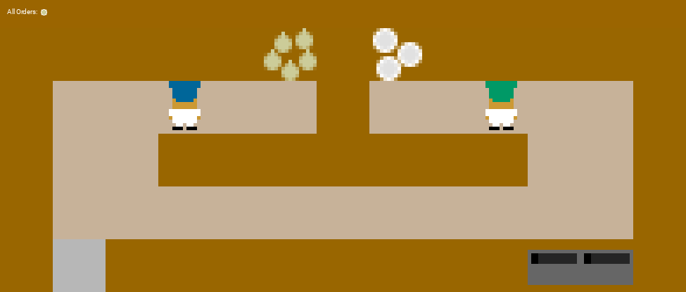

Results             .dot { height: 14px; width: 14px; background-color: #bbb; border-radius: 50%; display: inline-block;} .w3-card { display: inline-block;} .img { margin: 5px;} body, html {height: 100%;} body,h1,h2,h3,h4,h5,h6 {font-family: "Roboto", sans-serif} h1 {font-family: 'Roboto Condensed'; font-weight:100;} .menu {display: none}

A. Self-play analysis
=====================

First part of the results analysis focuses on describing map properties and acknowledge the presence of the "off diagonal problem".

1\. Which maps are hard even for self-play?
-------------------------------------------

You can see results here: [results\_sort\_basic\_allstacks.html](./results_sort_basic_allstacks.html)  
Primarily, I have compared experiment without stacking option, which are my most straightforward baseline. I have computed average results on the diagonal (cause that is where we suppose SP to be quite good), std error and Coefficient of variance , which is just the ratio of previous two metrics. In the results for nostack option, we can divide maps into three groups:

*   very hard maps (does not even convergate)
*   unstable maps (contains zero on diagonal, so they are expected to be hard even for SP). These maps also have lower avg results and they also have CoV over 0.3
*   Stable and quite easy map for SP, has CoV less or equal 0.3 and high average score on diagonal.

I have run same analysis for channels and tuple stacking options. We can see some maps have good score over all experimetns, while other maps performs substantially differently depending on the stacking type. There is more analysis on stacking influence following. It seems like 4 maps are just too hard even for self play - bottleneck, tutorial\_0, corridor, small\_corridor. Their maps are: small\_corridor, corridor, bottleneck, tutorial\_0  
#### small corridor

#### corridor

#### bottleneck

#### tutorial 0

The first two maps - corridor and small corridor have narrow corridor. This type of maps is sensitive to agents deadlock where both agents are waiting in the corridor for another agent to step back. We suppose same problem can be seen in bottleneck layout. Tutorial\_0 layout is different. There is no need for agents to cooperate heavily as only shared resource is plate disposer. In this layout, we have observed agents learning, unfortunately very slowly - 30x slower than other layouts (training whoel ref population of 30 agents would take more than a month so we categorized this layout as hard, although SP PPO converges at the end.

2\. Stacking influence
----------------------

Results for this part can be found here: [sorted\_stack\_np.html](./sorted_stack_np.html)  
all maps:

Results indisputably shows the important influence of frame stacking. Overall best is to have no stacking, which indicates that selfplay agents are not capable to use the potential of the information about history or they simply learn faster and sufficiently good without it. The worst type of frame stacking are channels, there are 5 maps, where chan experiments even did not converge. 
There are also some maps, although in minority, where channels performed quite good and I do not have an explanation yet. These are centre\_pots, cramped room and simple\_o.
#### simple o:

#### cramped_rom:

#### centre pots:

The first two differes only in resources placement, the third one is also similar in
sense it is wuite small room, with no blocking corridor but not with so much place either. 
Other maps, where channels worked quite well are:
#### five by five (again very similar to first two maps),
 
#### schelling_s

and 
#### centre objects
. 

There are other similar maps, where another stacking type was more succesfull and 
generally we cant see any reliable distinguishable pattern for stacking influence. 
_TODO vidí něco Martin?_ 

3\. qualitative analysis
------------------------

In the table with all results ([all\_results.html](./all_results.html)) you can see not the original resuls heat maps, but reordered ones (using hierarchical clustering to reorder rows and columns to group most similar vectors together). We can observe that for some layouts, 
training leads to clear clusters, which indicates existence of several mutually incompatible strategies.
This is strongly presented in:
forced coordination, pipeline, scenario1_s and scenario_2.
#### forced coordination:

#### pipeline

#### scenario1_s

#### scneario_2

_TODO analyzovat jake to jsou strategie._

4\. Off diagonal problem
------------------------

The off diagonal problems shows itself in many tested layouts, which can be seen on the heat map pictures. We also wanted to quantify this problem and explore various metrics which can provide new 
insights for this problem. You can see heat maps ordered by various 
metrics in the following tables:

*   [results\_off\_diagchannels.html](./results_off_diagchannels.html)
*   [results\_off\_diagnostack.html](./results_off_diagnostack.html)
*   [results\_off\_diagtuple.html](./results_off_diagtuple.html)

Different metrics causes different sorting into groups.  SDMO is quite interesting metric, 
because it basically sorts results into three groups - bad everywhere, off_diag problem and good everywhere
The ratio of the average on diagonal to average outside diagonal divides layouts which demonstrates off diagonal problem most clearly.  
_TODO chcem tady o tom ještě něco psát? _

There is one naother table with maxs and mins on diagonal:

A. POP training analysis
=====================

1\. Is population training better than SP?
-------------------------------------------
According to our results for POP training (see colorful table i have send you),
SP is definitely the worst performing technique if we compare the best final agents
on 15 or 30 quantile. If we compute an average over the whole population (minus 
init agents), SP is significantly better which indicates that agents (probably in earlier phases
of training) are quite bad and lower the overall average.

2\. How long does it takes for population to produce good robust agents? 
-------------------------------------------

3\. There are some "good columns" in heat maps - do they indicate easy ref agents for everyone? 
-------------------------------------------
Can these agent be more robust/suitable for cooperation than others? Can these agents be
good candidates for POP init agents? 

List of all available results follows:

Pages

[all\_results.html](./all_results.html)

[results\_off\_diagchannels.html](./results_off_diagchannels.html)

[results\_off\_diagnostack.html](./results_off_diagnostack.html)

[results\_off\_diagtuple.html](./results_off_diagtuple.html)

[results\_sort\_basic\_allstacks.html](./results_sort_basic_allstacks.html)

[results\_tables.html](./results_tables.html)

[sorted\_stack\_np.html](./sorted_stack_np.html)